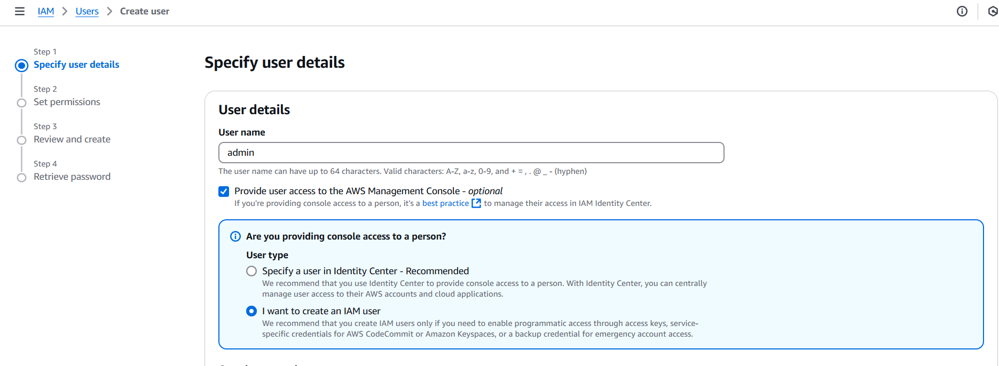
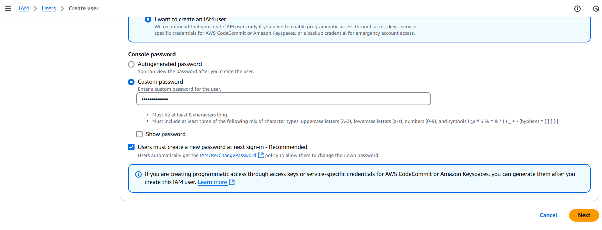
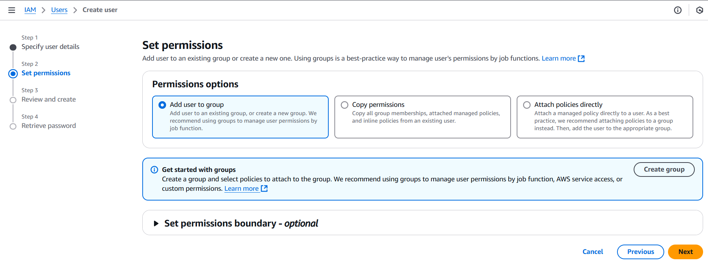
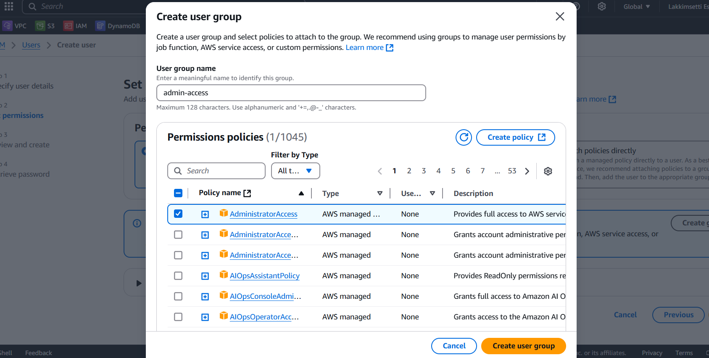
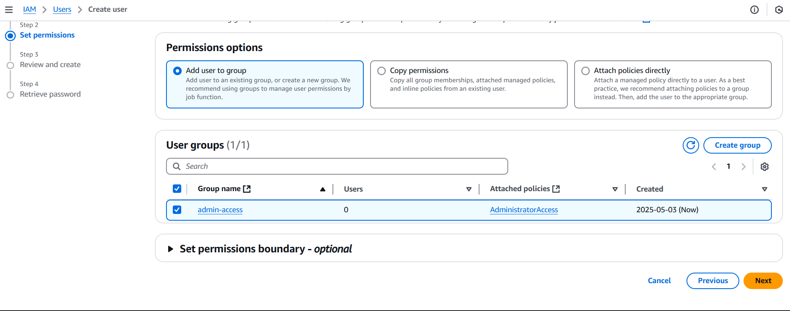
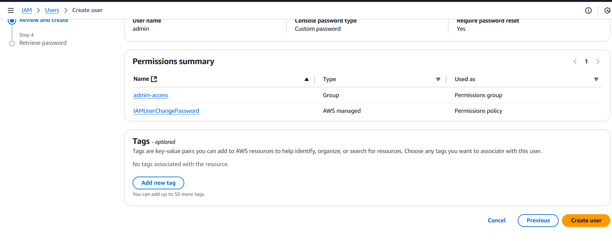
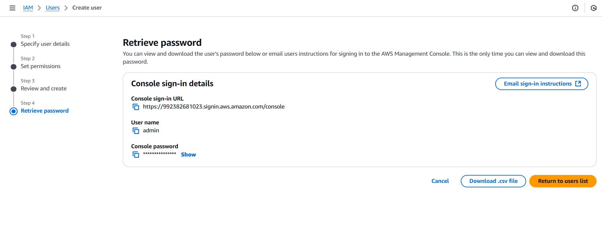

# IAM (Identity and access management)

IAM is used to control who can access AWS resources and what they can do with them.

#### Users
People who use AWS accounts (like you and your team numbers)
#### Groups
Collections of users
#### Roles
Temporary access with specific permissions
#### Policies
Rules define what actions are allowed or denied (like read only access to S3)

### Creating User and adding to group

